# 2022秋 数据结构 Project 开发文档
## 21302010017 王天泽
## 一、代码结构概要说明
整个代码从内到外分为了huffman, compressor, decompressor, command, main (parser) 五个部分  
以及包括了处理命令合法性的checker和处理文件夹的folder, 共七个部分  
## 1. Huffman部分  
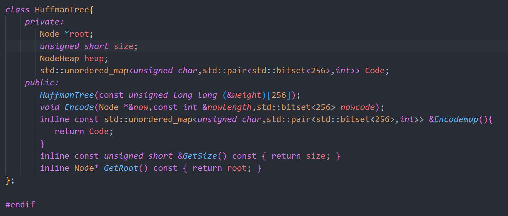  

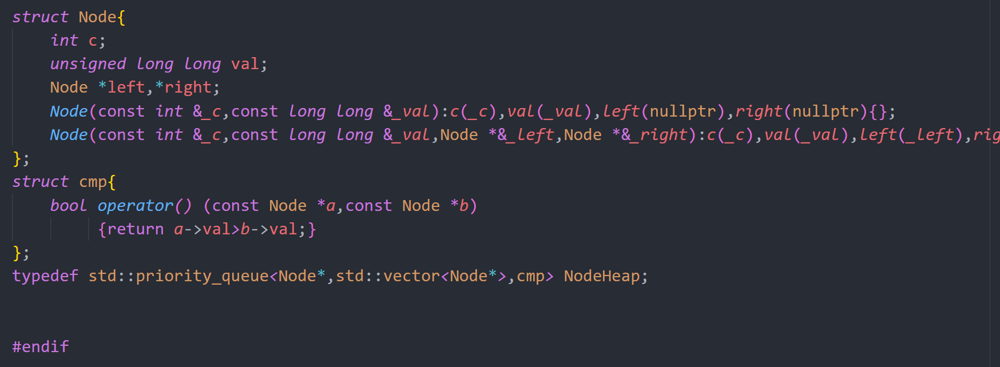  

huffman部分主要包括通过权值weight数组构建哈夫曼树，构建哈弗曼编码的方法，其底层主要是通过优先队列构建的堆来实现  
  
## 2. Compressor 部分  
其中包括单文件的 Compressor 和多文件的 FolderCompressor 两个类  
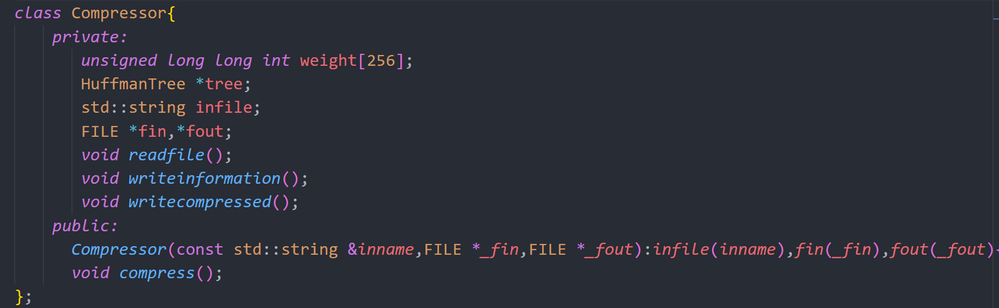  
  
Compressor部分处理单文件的压缩,   
压缩compress的实现分为readfile（读原文件）, writeinformation（记录原文件信息）, writedecompressed（写压缩文件）三个步骤  
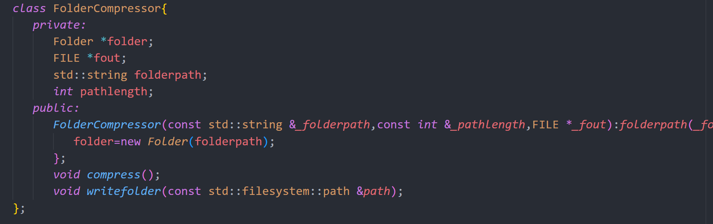  

FolderCompressor部分处理文件夹的压缩，  
其中所有文件的压缩都是借助组合一个Compressor来实现，记录文件夹的信息则是通过接口writefolder实现  
  
## 3. Decompressor 部分  
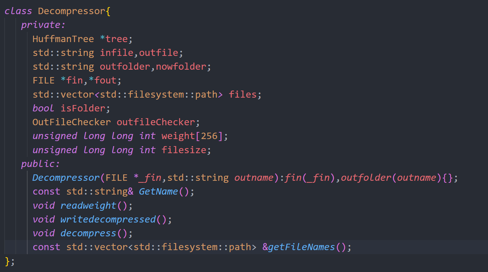  

Decompressor处理文件/文件夹的压缩  
解压decompress主要也分为getname, readweight, writedecompressed三个部分  
同时还提供了一个getfilenames的接口, 可供之后的display功能调用  

## 4. Command 部分  
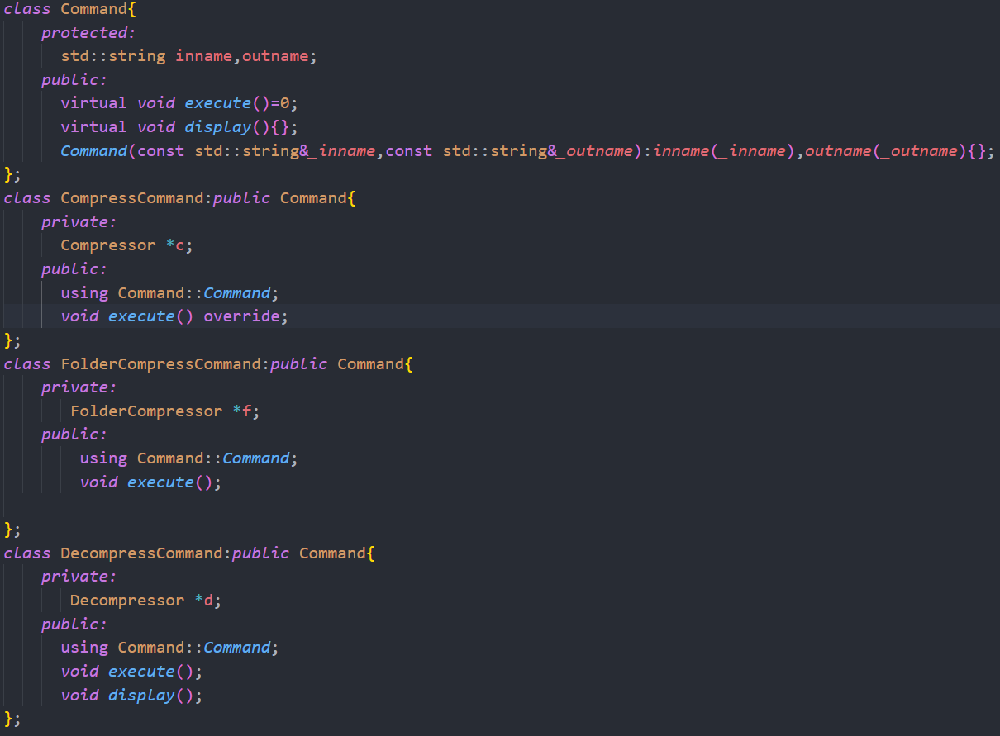  

运用命令模式，将内部具体的实现代码与外部的调用解耦，根据外部执行调用的命令，最后再在内部具体实现  
  
## 5. Main (Parser) 部分  
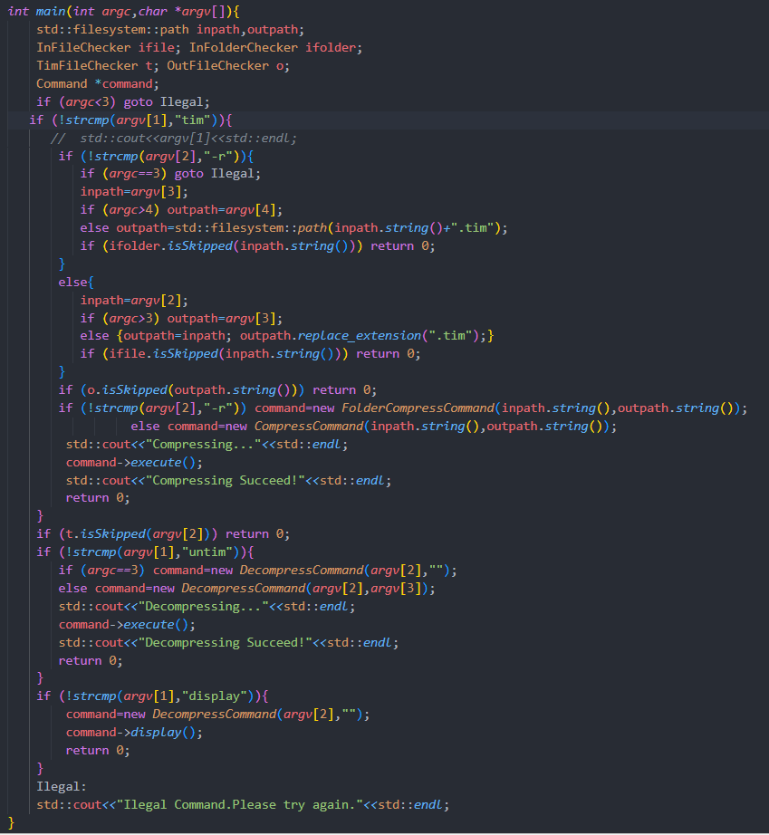  
  
Main部分主要起到的是Parser的作用，用于解析命令行所传递的指令，从而调用command，并执行  
  
## 6. Folder 部分
  

Folder部分主要是通过filesystem中的库函数来递归获取文件夹中的所有路径（包括文件与文件夹），便于之前FolderCompressor的操作  

## 7. Checker 部分  
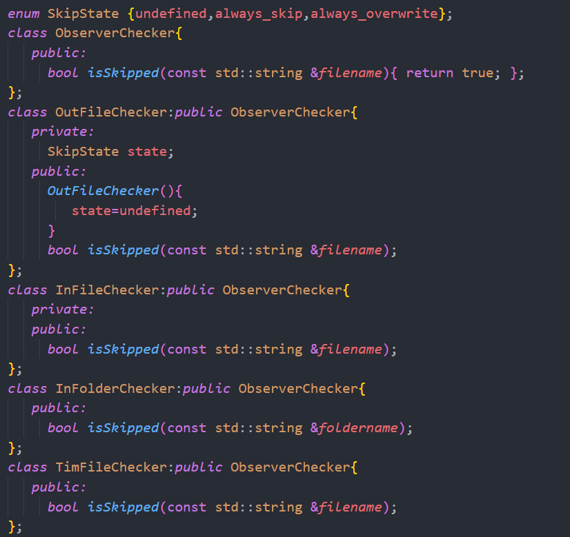  
  
Checker 部分主要使用了观察者模式，在打开输入文件(fin)，或是输出文件(fout)，判断命令的合法性  
  
## 二、项目核心需求与其他需求的实现  
## 1. 压缩文件的实现 (具体可见compressor.cpp)
首先，我们在读入文件过程中维护一个weight[256]数组，记录每个字符出现的次数，随后根据这个weight数组建立出一颗huffman树，并且得到huffman编码，huffman编码使用了bitset<256>,int的pair来存储，用于huffman编码长度不超过256（最多256个结点），可用bitset<256>存储，然后再用一个int记录编码长度即可  
接着我们在正式写入文件前先写入一些文件信息，包括文件名，文件的weight数组（便于解压后还原文件名和Huffman树），以及压缩后文件的长度（暂时先存为0，等到压缩文件写完后再通过fseek返回填充；便于在解压时判断文件是否结束）  
然后我们再次从头开始读文件，逐字符的通过huffman编码进行翻译，由于各个字符huffman编码长度不同，我们提供一个bitset<256> temp来供连续的字符进行合并，当temp的长度 (nowbit) 达到256后存入outbuffer中准备输出，重置temp  
  
  
最后我们在根据我们便输出便维护的outfilesize通过fseek存回到文件的信息部分即可  
  
## 2. 压缩文件夹的实现(具体可见compressor.cpp)  
首先我们借助folder类获取文件夹下的所有路径（包括文件与文件夹）  
接着依次处理即可  
当处理的是文件时，我们借助组合一个Compressor，即可实现  
当处理的是文件夹时，我们记录下文件夹的名字（便于在解压时先创立文件夹再打开文件，避免文件路径不存在的情况）同时本应输出weight数组size位置输出-1，表示当前为文件夹  
由于遍历的dfs顺序并不能保证文件夹这颗树的唯一性，同时为了节约空间并不愿意在每个处理文件中都记录包含完整文件的路径名，所以尝试在每次文件之间的路径发生改变时记录新的路径名称，既能避免记录重复路径的空间，也能保证这颗文件夹树的唯一性  
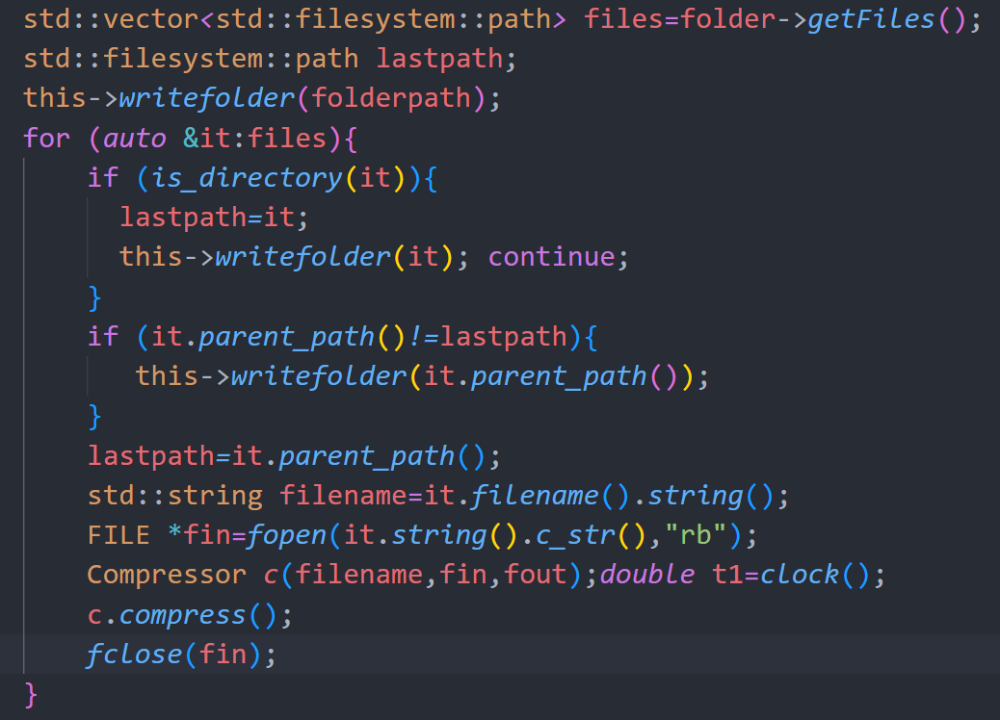
  
## 3. 解压缩文件/文件夹的实现(具体可见decompressor.cpp)
无论是文件/文件夹，解压方法的实现都是相同的  
首先读入filename/foldername，再根据weight数组的size判断是否为文件夹，为文件夹时创建当前目录即可  
若为文件，根据当前文件路径获取文件的带路径名字，接着读入weight数组(还原huffman树与编码)，再读入filesize（判断文件何时结束），然后逐位的读入0/1，从root开始0往left走，1往right走，当走到叶子结点之时，输出叶子结点的字符，重回root，直到读到filesize位置处表示当前文件结束  

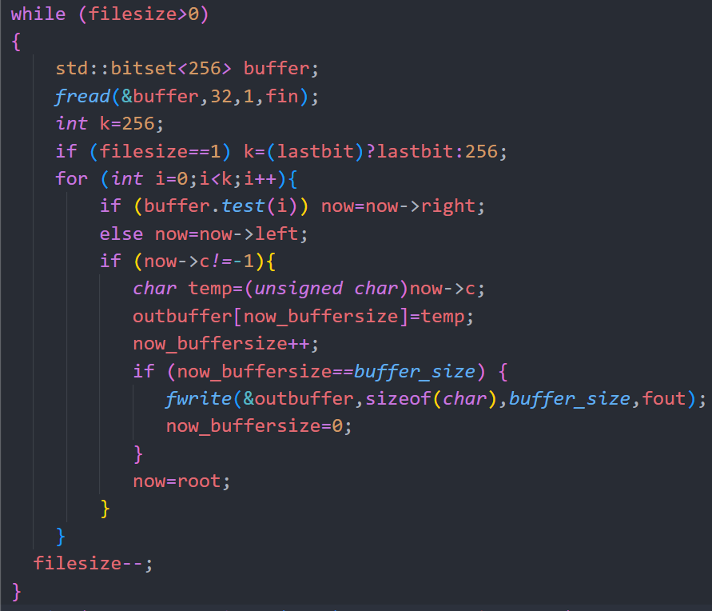  

如此循环，读到压缩文件的末尾即可  
  
## 4. 实现CLI与用户交互  
使用运行传参时的 argv 即可实现，在main.cpp（Parser）中对于argv逐部分解析，然后在调用command部分命令实现即可  
我设计的指令如下  
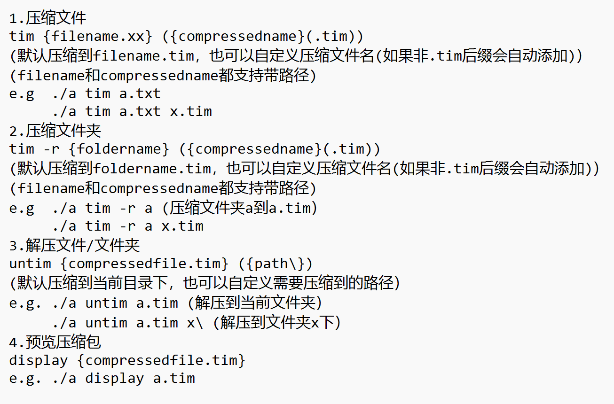  
  
## 5. 检验压缩包来源是否是自己的工具  
在parser和checker部分配合下，解决了这一问题  
checker部分包含一个TimFileChecker类，用于检查该文件是否为.tim格式的压缩文件  

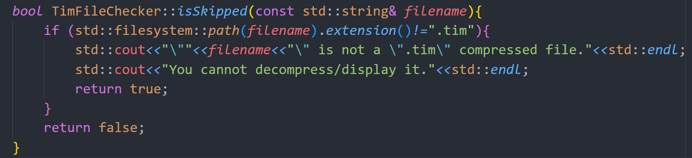  

在parser部分中，对于untim和display指令，我们设立这个TimFileChecker的观察者，并进行调用，如何属于非.tim文件，返回报错信息并且不执行  
  

## 6. 文件覆盖问题  
文件覆盖异常的处理同样是借助checker来处理，checker部分中包含一个OutFileChecker类，当面对覆盖文件时，我设立了四个可选项，包括跳过一次、覆盖一次、全部跳过、全部覆盖  
  
OutFileChecker根据需要主要存在于两个位置，一是在压缩文件之前，检查需要压缩到的文件名是否重复(parser,main部分)；二是解压文件之时，检查解压后的路径文件名是否已经存在(decompressor部分)  
  
## 7. 压缩包预览实现  
对于一个压缩包，我们先通过decompresor中接口getfilenames获取当前压缩包下所有文件/文件夹的名称(其中包括压缩时写入的文件夹路径)，这里借助filesize来fseek可以大大加快速度  

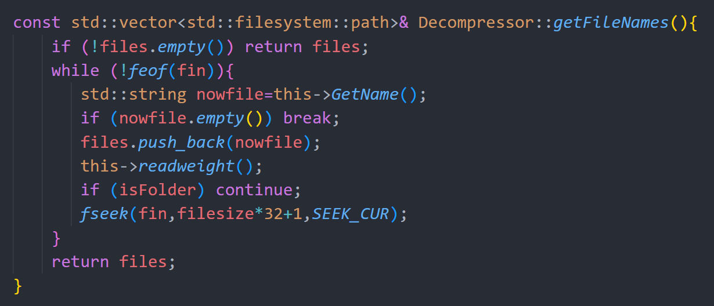  
  
然后在根据得到的序列打印出压缩包预览样式，维护一个level层数（表示当前文件/文件夹）在第几层，维护一个nowpath表示当前路径  
当得到的序列是一个新的文件夹newpath时，更新nowpath以及level，同时展示部分只需要展示newpath与nowpath的不同的部分即可  
对于文件，只需要根据level对齐即可  
  
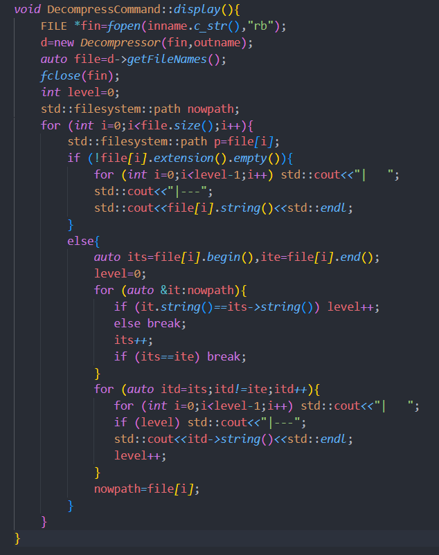  

## 三、开发环境/工具，编译/运行项目
本PJ均在Windows下VS Code中开发完成  
编译方式：通过多文件的连接编译即可，将所有.h/.cpp文件放入同一目录，然后g++ -O2 main.cpp command.cpp checker.cpp folder.cpp compressor.cpp decompressor.cpp huffman.cpp  
运行方式：在控制台按照下表提示运行即可（默认编译出的运行文件为a.exe）  

  

## 四、性能检测结果

| 文件名  | 初始大小 | 压缩后大小 | 压缩率 | 压缩时间 | 解压时间 |
| :---    |    :----:   |          :----: | :---: | :---: |    :---:|
| 1\empty.txt   | 0 KB     | 1 KB   | / | 19.79ms | 22.13ms
| 2\1.txt   |   1939KB        | 1086KB      |  56.0% | 41.83ms| 49.00ms  
| 2\7.pdf | 127KB|103KB| 81.1%|32.89ms|25.68ms  
2\20.mov| 1648KB|1563KB|94.8%|55.16ms|55.00ms  
2\27.mp3| 1311KB|1302KB|99.3% |48.32ms|47.24ms  
3\1.jpg|20262KB| 20208KB|99.7% |249.6ms| 257.82ms  
3\3.csv|628333KB|402067KB|63.9% | 8.33s | 5.65s  
4\Empty|0KB|1KB|/|20.59ms| 25.33ms  
5\1|596KB|378KB|63.4% |31.96ms | 33.67ms  
5\3|1.10MB|1.10MB| 100%|38.02ms| 44.22ms  
6\3|430MB|430MB|100%  |8.00s| 9.77s  
7\3|1.01G|658MB| 63.6% |13.80s| 9.70s  
8\1.csv|613MB|392MB|63.9% |8.47s| 5.48s  
9\1.csv|421MB|264MB|62.7% |5.08s| 4.20s|  
  
## 五、与其他压缩工具的比较
小文件：2\7.pdf 127KB 
| 压缩工具 | 压缩率 | 压缩时间 |  
| :---    |    :----:   |          :----: |         
我的程序|  81.1%| 32.89ms  
WinRAR  |72.4%| 40.03ms
7-ZIP| 70.0%|41.86ms  
  
大文件：9\1.csv  421MB
| 压缩工具 | 压缩率 | 压缩时间 |  
| :---    |    :----:   |          :----: |         
我的程序|  62.7%| 5.08s  
WinRAR  |16.8%| 12.64s  
7-ZIP| 15.4% | 33.00s

文件夹：6\3  430MB
| 压缩工具 | 压缩率 | 压缩时间 |  
| :---    |    :----:   |          :----: |         
我的程序|  100%| 5.08s  
WinRAR  |97.44%| 21.79s  
7-ZIP| 96.7% | 28.92s  
  
在这三组比较中可以看出，WinRar和7-ZIP在压缩时间上可能一定程度上不如我自己的程序，但压缩率远远小于  
原因在于我所使用的Huffman算法并不存在字典的概念，是完全不依赖于内存，压缩前后的文件可以独立相互转换，而无论是WinRaR的PPMII还是7-ZIP的LZMA算法都会在电脑中存入字典  
WinRAR存入的字典大小大约是256KB，7-ZIP大约是512KB，因此在压缩过程中，7-ZIP能获得到更低的压缩率，但在压缩时也会消耗更多的内存，导致压缩速度减慢  
总体来说，在一般情况下，字典越大能获得更低压缩率但压缩时间也会更长  
  
## 六、遇到的困难与解决方案
### 1. 关于在压缩时最后写入的位数不是256的整数倍  
（后面有一系列的0）可能会导致解压时错误  
解决方案：运用1个byte（8位）0-255来记录压缩时写入的最后一个的长度，当解压读到最后一个bitset<256>时，读到这个lastbit即可结束，防止有过多的后继0影响解压  
### 2. 关于文件夹解压时无法确定文件何时结束  
解决方案：在压缩时先在正文之前腾出一定空间用来回头补充压缩文件的长度大小，然后在压缩过程中统计压缩文件的长度，再借用fseek回到最初腾出的位置，记录下压缩文件的长度；这样在解压时，就可以先读到文件的长度，再读文件内容，从而确定当前文件何时结束  
  
## 七、其他一些补充
### 1. 异常处理的一些补充
除了要求中提到的是否覆盖文件以及原文件来源的检查，在异常处理情况中可能还会出现输入文件不存在的情况，因此我对这部分也进行异常
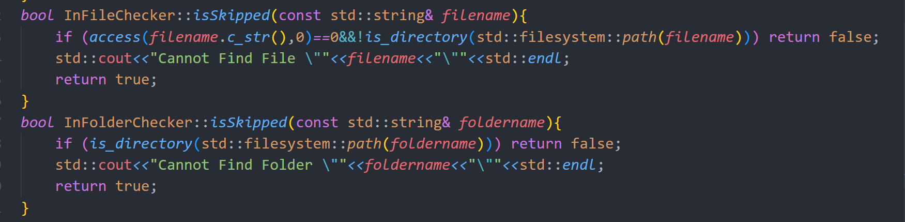   

当用户想要压缩的文件/文件夹，或是想要解压的文件不存在时，给出提示，避免用户可能因输错文件名而得不到正常运行结果而不知所措  
### 2. 对于输入/输出文件名的优化处理  
无论是压缩或是解压的文件/文件夹，若是不在当前路径，均可使用路径的方式输入进行处理，且在保存信息以及解压中也只会保留该文件/文件夹的原始不带路径的文件名，优化体验
